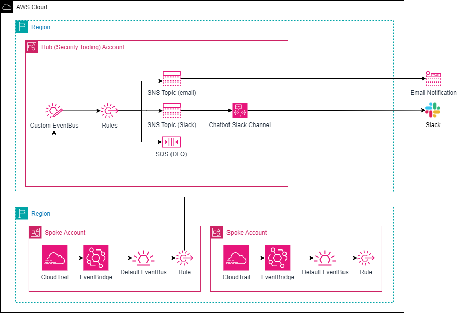

# Organization Wide Security Alerts

## Description

This project deploys a simple centralized security alerting solution using a hub-and-spoke pattern. It sets up a custom EventBridge event bus, alert rules, and an SNS topic(s) in the hub account. EventBridge rules are then deployed to each spoke account to forward events to the central event bus in the hub account.

Forwarding rules can be deployed organization-wide across all regions or selectively to chosen accounts.

Alerts can be delivered via email and/or Slack. You can choose alert delivery method during deployment.




## Alerts

Currently monitored and alerted activities:

- Root user console sign in attempts: successes and failures (`org-sec-alerts-general-alerts.yaml`)
  - `signin:ConsoleLogin`
- Root user federated console session (sign in) (`org-sec-alerts-general-alerts.yaml`)
  - `sts:GetFederationToken`
  - `signin:GetSigninToken`
  - `signin:ConsoleSignin`
- Root user password recovery (`org-sec-alerts-general-alerts.yaml`)
  - `signin:PasswordRecoveryRequested`
  - `signin:PasswordRecoveryCompleted`
- Root user access key creation, deletion, updates (`org-sec-alerts-general-alerts.yaml`)
  - `iam:CreateAccessKey`
  - `iam:DeleteAccessKey`
  - `iam:UpdateAccessKey`
- Root user temporary security credential creation (`org-sec-alerts-general-alerts.yaml`)
  - `sts:GetSessionToken`
  - `sts:GetFederationToken`
- Root user MFA device actions (`org-sec-alerts-general-alerts.yaml`)
  - `iam:CreateVirtualMFADevice`
  - `iam:DeleteVirtualMFADevice`
  - `iam:DeactivateMFADevice`
  - `iam:EnableMFADevice`
  - `iam:ResyncMFADevice`
- Root user (account) email change (`org-sec-alerts-general-alerts.yaml`)
  - `iam:UpdateAccountEmailAddress`
  - `signin:EmailUpdated`
- Root user password change (`org-sec-alerts-general-alerts.yaml`)
  - `iam:ChangePassword`
  - `signin:PasswordUpdated`
- Root user CloudFront key pair creation, deletion, updates (`org-sec-alerts-general-alerts.yaml`)
  - `iam:UploadCloudFrontPublicKey`
  - `iam:DeleteCloudFrontPublicKey`
  - `iam:UpdateCloudFrontPublicKey`
- Root user X.509 Signing certificate creation, deletion, updates (`org-sec-alerts-general-alerts.yaml`)
  - `iam:UploadSigningCertificate`
  - `iam:DeleteSigningCertificate`
  - `iam:UpdateSigningCertificate`
- Account contact information change: phone number, address, name (`org-sec-alerts-general-alerts.yaml`)
  - `account:PutContactInformation`
- AWS Organizations configuration changes (`org-sec-alerts-general-alerts.yaml`)
  - `organizations:CreateAccount`
  - `organizations:CreateGovCloudAccount`
  - `organizations:MoveAccount`
  - `organizations:CloseAccount`
  - `organizations:RemoveAccountFromOrganization`
  - `organizations:InviteAccountToOrganization`
  - `organizations:LeaveOrganization`
  - `organizations:CreateOrganization`
  - `organizations:DeleteOrganization`
  - `organizations:CreateOrganizationalUnit`
  - `organizations:DeleteOrganizationalUnit`
  - `organizations:UpdateOrganizationalUnit`
  - `organizations:RegisterDelegatedAdministrator`
  - `organizations:DeregisterDelegatedAdministrator`
  - `organizations:EnableAllFeatures`
  - `organizations:EnableAWSServiceAccess`
  - `organizations:DisableAWSServiceAccess`
  - `organizations:AcceptHandshake`
  - `organizations:CancelHandshake`
  - `organizations:DeclineHandshake`
  - `organizations:CreatePolicy`
  - `organizations:UpdatePolicy`
  - `organizations:DeletePolicy`
  - `organizations:AttachPolicy`
  - `organizations:DetachPolicy`
  - `organizations:EnablePolicyType`
  - `organizations:DisablePolicyType`
  - `organizations:TagResource`
  - `organizations:UntagResource`

## Deployment

- Required stacks:
  - `org-sec-alerts-central-bus.yaml`. This stack creates a central event bus, SNS queues for email and Slack alerts, SQS dead-letter-queue, and Chatbot Slack channel configuration. This stack should be deployed in the Security Tooling (audit) account.
  - `org-sec-alerts-event-fwding.yaml`. This stack creates EventBridge rules that forward events to the central event bus. It needs to be deployed in every relevant account and region. You can do so using your preferred method or the provided StackSet template (`org-sec-alerts-event-fwding-stackset.yaml`).
- Optional alert rule stacks:
  - `alert-rules/org-sec-alerts-general-alerts.yaml` - This stack sets up EventBridge rules for generating general alerts.
    - This stack depends on `org-sec-alerts-central-bus.yaml` stack.
  - `alert-rules/org-sec-alerts-cloudtrail-alerts.yaml` - This stack sets up EventBridge rules to trigger alerts upon detecting changes in CloudTrail or associated resource configurations.
    - This stack depends on `org-sec-alerts-central-bus.yaml` stack.

### Step 1: Deploy `org-sec-alerts-central-bus.yaml`
---
- If you want to receive email alerts set `pDeployEmailAlerts` value to `yes` and provide `pCriticalAlertEmail`.
- If you want to receive Slack alerts set `pDeploySlackAlerts` value to `yes` and provide `pSlackWorkspaceId` and `pSlackChannelId`.
  - To provide the required Slack workspace ID, you must perform the initial authorization flow with Slack in the AWS Chatbot console, then copy and paste the workspace ID from the console. See [Get started with Slack | AWS Chatbot](https://docs.aws.amazon.com/chatbot/latest/adminguide/slack-setup.html) for detailed steps.
- After the stack has been created, you will receive an email requesting that you confirm the subscription to the SNS topic.

```bash
aws cloudformation deploy \
    --template-file org-sec-alerts-central-bus.yaml \
    --stack-name org-sec-alerts-central-bus \
    --parameter-overrides \
        pOrgID=o-abc123def4 \
        pDeployEmailAlerts=yes \
        pCriticalAlertEmail=criticalalerts@email.com \
        pDeploySlackAlerts=yes \
        pSlackWorkspaceId=T01ASDFGHJK \
        pSlackChannelId=C06ASDFGHJK \
        pWorkloadIdTag=org-sec-alerts \
        pEnvironmentIdTag=prod \
        pOwnerNameTag=secops
```

### Step 2: Deploy `org-sec-alerts-event-fwding.yaml`
---

- To deploy using StackSet template:
  - 1. Modify regions in the `org-sec-alerts-event-fwding-stackset.yaml` template to include all the regions you want to deploy to. Currently it only deploys to `us-east-1` region.
  - 2. Upload `org-sec-alerts-event-fwding.yaml` template to an S3 bucket.
  - 3. Deploy StackSet in the management account or delegated CloudFormation StackSet admin account:
    ```bash
    aws cloudformation deploy \
        --template-file org-sec-alerts-event-fwding-stackset.yaml \
        --stack-name org-sec-alerts-event-fwding-stackset \
        --parameter-overrides \
            pOrgSecEventBus=arn:aws:events:us-east-1:123456789012:event-bus/org-sec-event-bus \
            pDeployTargetOrgUnitId=r-abcd \
            pTemplateURL=https://BUCKETNAME.s3.amazonaws.com/org-sec-alerts-event-fwding.yaml \
            pWorkloadIdTag=org-sec-alerts \
            pEnvironmentIdTag=prod \
            pOwnerNameTag=secops
    ```
  - 4. Deploy `org-sec-alerts-event-fwding.yaml` template in the management account. This needs to be done manually because StackSet uses serviced managed permission model and does not deploy templates to the management account.
    ```bash
    aws cloudformation deploy \
        --template-file org-sec-alerts-event-fwding.yaml \
        --stack-name org-sec-alerts-event-fwding \
        --capabilities "CAPABILITY_NAMED_IAM" \
        --parameter-overrides \
            pOrgSecEventBus=arn:aws:events:us-east-1:123456789012:event-bus/org-sec-event-bus \
            pWorkloadIdTag=org-sec-alerts \
            pEnvironmentIdTag=prod \
            pOwnerNameTag=secops
    ```

### (Optional) Step 3: Deploy `org-sec-alerts-general-alerts.yaml`
---
- If you want to receive email alerts you must deploy central bus stack with parameter `pDeployEmailAlerts=yes` and set `pSendEmailAlerts` value to `yes`.
- If you want to receive Slack alerts you must deploy central bus stack with parameter `pDeploySlackAlerts=yes` and set `pSendSlackAlerts` value to `yes`.

```bash
aws cloudformation deploy \
    --template-file org-sec-alerts-general-alerts.yaml \
    --stack-name org-sec-alerts-general-alerts \
    --parameter-overrides \
        pCentralBusStackName="org-sec-alerts-central-bus" \
        pSendEmailAlerts=yes \
        pSendSlackAlerts=yes
```

### (Optional) Step 4: Deploy `org-sec-alerts-cloudtrail-alerts.yaml`
---
- If you want to receive email alerts you must deploy central bus stack with parameter `pDeployEmailAlerts=yes` and set `pSendEmailAlerts` value to `yes`.
- If you want to receive Slack alerts you must deploy central bus stack with parameter `pDeploySlackAlerts=yes` and set `pSendSlackAlerts` value to `yes`.

```bash
aws cloudformation deploy \
    --template-file org-sec-alerts-cloudtrail-alerts.yaml \
    --stack-name org-sec-alerts-cloudtrail-alerts \
    --parameter-overrides \
        pCentralBusStackName="org-sec-alerts-central-bus" \
        pSendEmailAlerts=yes \
        pSendSlackAlerts=yes \
        pTrailName="org-cloudtrail" \
        pKMSKeyArn="arn:aws:kms:us-east-1:222222222222:key/ae965708-a783-460a-ae77-fd8f0b8ea511" \
        pKMSAliasArn="arn:aws:kms:us-east-1:222222222222:alias/org-cloudtrail-key" \
        pS3BucketArns="arn:aws:s3:::org-cloudtrail-logs-a1b2c3d4e5fg6h7i,arn:aws:s3:::org-cloudtrail-logs-a1b2c3d4e5fg6h7i-access-logs" \
        pLogGroupName="/aws/cloudtrail/org-cloudtrail" \
        pTopicArn="arn:aws:sns:us-east-1:222222222222:org-cloudtrail-file-delivery"
```

## Deployed Resources

- `org-sec-alerts-central-bus.yaml` deploys:
  - `org-sec-event-bus`                           - EventBridge event bus
  - `org-sec-alerts-crit-email`                   - critical email alert SNS topic
  - `org-sec-alerts-crit-slack`                   - critical Slack alert SNS topic
  - `org-sec-alerts-dlq`                          - DLQ SQS queue
  - `org-sec-alerts-slack-channel`                - AWS Chatbot Slack channel configuration
  - `org-sec-alerts-slack-channel-role`           - IAM role for AWS Chatbot Slack channel

- `org-sec-alerts-event-fwding.yaml` deploys:
  - `org-sec-alerts-root-signin-fwd-rule`         - EventBridge event forwarding rule
  - `org-sec-alerts-root-iam-fwd-rule`            - EventBridge event forwarding rule
  - `org-sec-alerts-root-sts-fwd-rule`            - EventBridge event forwarding rule
  - `org-sec-alerts-account-fwd-rule`             - EventBridge event forwarding rule
  - `org-sec-alerts-kms-fwd-rule`                 - EventBridge event forwarding rule
  - `org-sec-alerts-cloudtrail-fwd-rule`          - EventBridge event forwarding rule
  - `org-sec-alerts-s3-fwd-rule`                  - EventBridge event forwarding rule
  - `org-sec-alerts-cloudwatch-fwd-rule`          - EventBridge event forwarding rule
  - `org-sec-alerts-sns-fwd-rule`                 - EventBridge event forwarding rule
  - `org-sec-alerts-event-fwd-rule-role`          - EventBridge Rule IAM execution role

- `org-sec-alerts-event-fwding-stackset.yaml` deploys:
  - `org-sec-alerts-event-fwding-stackset`        - StackSet

- `org-sec-alerts-general-alerts.yaml` deploys:
  - `org-sec-alerts-root-signin-rule`             - EventBridge alert rule
  - `org-sec-alerts-root-iam-rule`                - EventBridge alert rule
  - `org-sec-alerts-root-sts-rule`                - EventBridge alert rule
  - `org-sec-alerts-account-rule`                 - EventBridge alert rule

- `org-sec-alerts-cloudtrail-alerts.yaml` deploys"
  - `org-sec-alerts-cloudtrail-trail-rule`        - EventBridge alert rule
  - `org-sec-alerts-cloudtrail-kms-rule`          - EventBridge alert rule
  - `org-sec-alerts-cloudtrail-s3-rule`           - EventBridge alert rule
  - `org-sec-alerts-cloudtrail-cloudwatch-rule`   - EventBridge alert rule
  - `org-sec-alerts-cloudtrail-sns-rule`          - EventBridge alert rule
