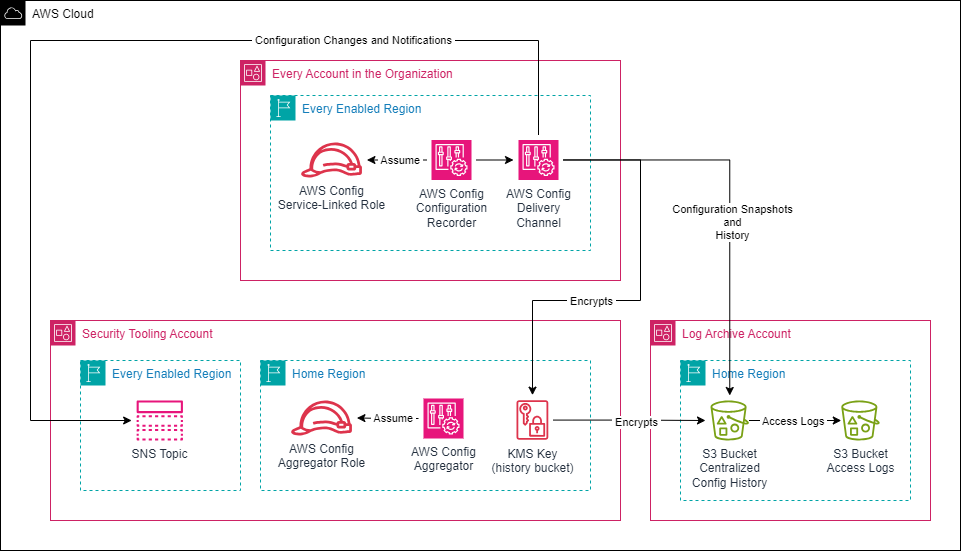

# Organizational AWS Config Deployment

## Description

This solution deploys AWS Config in all existing and future AWS Organization member accounts.



## Deployment

**This solution is intended for deployment from the security tooling account.** Deploying from a different account will necessitate minor template adjustments.

### Step 1: Enable AWS Config as a Trusted Service in Organizations

Enable AWS Config (`config.amazonaws.com`) and AWS Config Multi-Account Setup (`config-multiaccountsetup.amazonaws.com`) as a Trusted Service in Organizations.

```bash
./../../bin/enable_trusted_access_for_config.sh
```

### Step 2: Register a Delegated Administrator Account

Register the security tooling account as a delegated administrator for AWS Config and AWS Config Multi-Account Setup.

```bash
./../../bin/enable_delegated_admin_for_config.sh 222222222222
```

### Step 3: Deploy `aws-config-org-deployment.yaml`

Deploy `aws-config-org-deployment.yaml` CloudFormation template in the security tooling account. This template deploys all required resources via nested stacks and stacksets. It deploys:
- `aws-config-org-bucket-kms-key.yaml` in the current account and region via nested stack
- `aws-config-org-bucket.yaml` in the log archive account, current region via stackset
- `aws-config-org-sns.yaml` in every provided region of the security tooling account
- `aws-config-org.yaml` in every provided region of every organization member account via stackset and organization management account via stackset
- `aws-config-org-aggregator.yaml` in the current account and region via nested stack

#### Step 3a: Create IAM Roles Required for Deploying CloudFormation StackSets with Self-Managed Permissions

In order to deploy CloudFormation StackSets with self-managed permissions, we need to create admin and execution IAM roles.
You can deploy them using `cloudformation/stackset-roles` solution from this project. See [Readme](../../cloudformation/README.md) for more details.

#### Step 3b: Upload Templates to S3 Bucket

Upload all necessary templates to the S3 bucket used for storing CloudFormation templates.

```bash
aws s3 cp . s3://BUCKETNAME \
    --recursive \
    --exclude "*" \
    --include "aws-config-org*" \
    --exclude "*deployment.yaml"
```

#### Step 3c: Deploy `aws-config-org-deployment.yaml`

```bash
aws cloudformation deploy \
    --template-file aws-config-org-deployment.yaml \
    --stack-name aws-config-org-deployment \
    --capabilities "CAPABILITY_NAMED_IAM" \
    --parameter-overrides \
        pArtifactBucketURL="https://BUCKETNAME.s3.amazonaws.com" \
        pDeployTargetOrgUnitId=r-abcd \
        pStackSetAdminRoleName="AWSCloudFormationStackSetAdministrationRole" \
        pStackExecutionRoleName="AWSCloudFormationStackSetExecutionRole" \
        pEnabledRegions="us-east-1,us-west-2" \
        pOrgID=o-abc123def4 \
        pConfigBucketKeyAlias=aws-config-org-bucket-key \
        pSecurityToolingAccountId=222222222222 \
        pLogArchiveAccountId=333333333333 \
        pManagementAccountId=111111111111 \
        pBucketNameSuffix=a1b2c3d4e5fg6h7i \
        pWorkloadIdTag=aws-config-org \
        pEnvironmentIdTag=prod \
        pOwnerNameTag=secops
```

## Deployed Resources

- `aws-config-org-bucket-kms-key.yaml` deploys:
    - `${pConfigBucketKeyAlias}`                               - KMS Key
- `aws-config-org-bucket.yaml` deploys:
    - `aws-config-history-${pBucketNameSuffix}`                - S3 bucket
    - `aws-config-history-${pBucketNameSuffix}-access-logs`    - S3 bucket
- `aws-config-org-sns.yaml` deploys:
    - `aws-config-org-stream-${AWS::Region}`                   - SNS Topic
- `aws-config-org.yaml` deploys:
    - `AWSServiceRoleForConfig`                                - IAM Service-Linked Role
    - `default`                                                - AWS Config Configuration Recorder
    - `default`                                                - AWS Config Delivery Channel
- `aws-config-org-aggregator.yaml` deploys:
    - `AWSConfigAggregatorRole`                                - IAM Role
    - `aws-config-org-aggregator`                              - AWS Config Aggregator

- `aws-config-org-deployment.yaml` deploys:
    - `rConfigBucketKMSKeyStack`                               - Stack for `aws-config-org-bucket-kms-key.yaml`
    - `aws-config-org-bucket`                                  - StackSet for `aws-config-org-bucket.yaml`
    - `aws-config-org-sns-topics`                              - StackSet for `aws-config-org-sns.yaml`
    - `aws-config-org-recorders`                               - StackSet for `aws-config-org.yaml`
    - `aws-config-org-mgmt-recorder`                           - StackSet for `aws-config-org.yaml`
    - `rConfigAggregatorStack`                                 - Stack for `aws-config-org-aggregator.yaml`
