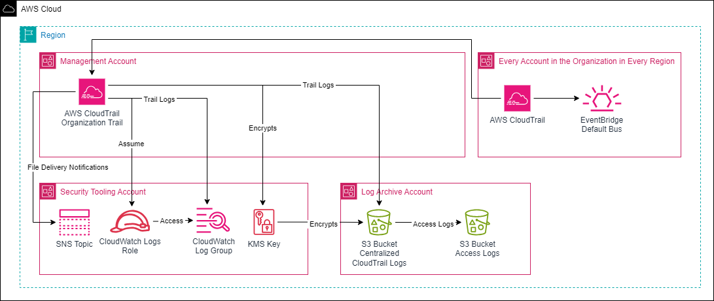

# AWS CloudTrail Organization Trail

## Description

This project deploys AWS CloudTrail organization trail in accordance to best practices.



## Deployment

This solution requires you to deploy three CloudFormation stacks.

### Step 1: Register a Delegated Administrator Account

Register the Security Tooling account as a delegated administrator for AWS CloudTrail.

```bash
./../scripts/enable_delegated_admin_for_cloudtrail.sh 222222222222
```

### Step 2: Deploy `org-cloudtrail-aux.yaml`

Creates an AWS KMS encryption key, CloudWatch Logs log group (optional), and SNS Topic for the organization CloudTrail file delivery notifications (optional). Deploy this stack in the Security Tooling account.

You can disable CloudWatch Logs log group creation by setting `pEnableCloudWatchLogs` parameter value to `no`.
You can disable SNS Topic creation by setting `pEnableSNSTopic` parameter value to `no`.

```bash
aws cloudformation deploy \
    --template-file org-cloudtrail-aux.yaml \
    --stack-name org-cloudtrail-aux \
    --capabilities "CAPABILITY_NAMED_IAM" \
    --parameter-overrides \
        pOrgTrailName=org-cloudtrail \
        pManagementAccountId=111111111111 \
        pOrgID=o-1234567890 \
        pOrgTrailKeyAlias=org-cloudtrail-key \
        pEnableCloudWatchLogs=yes \
        pOrgTrailLogGroupRetention=400 \
        pEnableSNSTopic=yes \
        pWorkloadIdTag=org-cloudtrail \
        pEnvironmentIdTag=prod \
        pOwnerNameTag=secops
```

### Step 3: Deploy `org-cloudtrail-bucket.yaml`
---
Creates S3 buckets for the organization CloudTrail logs and bucket access logs. Deploy this stack in the Log Archive account.

```bash
aws cloudformation deploy \
    --template-file org-cloudtrail-bucket.yaml \
    --stack-name org-cloudtrail-bucket \
    --parameter-overrides \
        pBucketNameSuffix=a1b2c3d4e5fg6h7i \
        pManagementAccountId=111111111111 \
        pOrgID=o-1234567890 \
        pOrgTrailName=org-cloudtrail \
        pOrgTrailKeyArn=arn:aws:kms:us-east-1:222222222222:key/ae965708-a783-460a-ae77-fd8f0b8ea511 \
        pWorkloadIdTag=org-cloudtrail \
        pEnvironmentIdTag=prod \
        pOwnerNameTag=secops
```
### Step 4: Deploy `org-cloudtrail.yaml`
---
Creates an AWS CloudTrail organization trail.

To adhere to best practices, we aim to deploy this stack in the Security Tooling account using delegated administrators, but CloudFormation currently doesn't support it (see bug: https://github.com/aws-cloudformation/cloudformation-coverage-roadmap/issues/1932). Until the issue is resolved, we must deploy it in the management account.

However, deploying in the management account poses an issue with CloudWatch Log group, which in this design is located in the Security Tooling account. According to CloudTrail documentation: both the CloudWatch Logs log group and log role must exist in the **calling** account.

To resolve this, we'll initially deploy the stack in the management account without CloudWatch Log integration (`pEnableCloudWatchLogs=no`), then enable it using `update-trail` command from the Security Tooling account.

```bash
aws cloudformation deploy \
    --template-file org-cloudtrail.yaml \
    --stack-name org-cloudtrail \
    --parameter-overrides \
        pOrgTrailName=org-cloudtrail \
        pOrgTrailKeyArn="arn:aws:kms:us-east-1:222222222222:key/ae965708-a783-460a-ae77-fd8f0b8ea511" \
        pOrgTrailBucketName=org-cloudtrail-logs-a1b2c3d4e5fg6h7i \
        pEnableCloudWatchLogs=no \
        pEnableSNSTopic=yes \
        pSnsTopicName="arn:aws:sns:us-east-1:222222222222:org-cloudtrail-file-delivery" \
        pWorkloadIdTag=org-cloudtrail \
        pEnvironmentIdTag=prod \
        pOwnerNameTag=secops
```

Update trail from the Security Tooling account:
```bash
aws cloudtrail update-trail \
    --name "arn:aws:cloudtrail:us-east-1:222222222222:trail/org-cloudtrail" \
    --cloud-watch-logs-log-group-arn "arn:aws:logs:us-east-1:222222222222:log-group:aws-cloudtrail/org-cloudtrail:*" \
    --cloud-watch-logs-role-arn "arn:aws:iam::222222222222:role/CloudTrailRoleForCloudWatchLogs-org-cloudtrail"
```

## Deployed Resources

- `org-cloudtrail-aux.yaml` deploys:
  - `${pOrgTrailKeyAlias}`                                 - KMS Key
  - `aws-cloudtrail/${pOrgTrailName}`                      - CloudWatch Logs log group
  - `CloudTrailRoleForCloudWatchLogs-${pOrgTrailName}`     - IAM Role
  - `${pOrgTrailName}-file-delivery`                       - SNS Topic
- `org-cloudtrail-bucket.yaml` deploys:
  - `org-cloudtrail-logs-${pBucketNameSuffix}`             - S3 bucket
  - `org-cloudtrail-logs-${pBucketNameSuffix}-access-logs` - S3 bucket
- `org-cloudtrail.yaml` deploys:
  - `${pOrgTrailName}`                                     - CloudTrail
